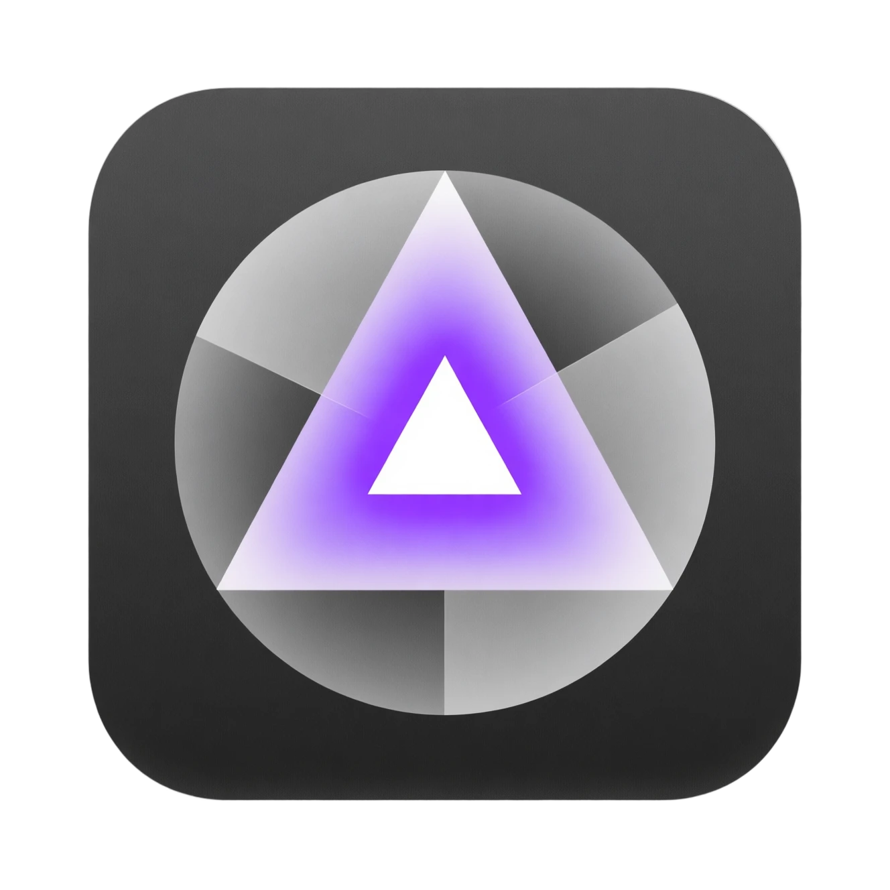

[中文](./README.md)

<div align="center">
  

  # ModelScope Prism

  **Chat · Vision · Art — Your All-in-One ModelScope Exploration Space**

  [](https://www.gnu.org/licenses/agpl-3.0)
  
  
</div>

---

**ModelScope Prism** is a modern AI client built with Next.js, designed specifically for the powerful API services of ModelScope community. It integrates three core capabilities: **LLM Deep Chat**, **VLM Visual Understanding**, and **AIGC Professional Image Generation**, providing you with a smooth, beautiful, and powerful AI experience.

### ✨ Key Highlights

- **🧠 Deep Thinking Mode**: Perfectly supports **DeepSeek-R1**, **Qwen3**, **GLM-4.7**, and other advanced models. Enable reasoning to visualize the Chain of Thought (CoT) and see exactly how the AI solves problems.
- **🎨 Professional AIGC Canvas**: Not just image generation—supports **LoRA model loading**, **CFG/Steps fine-tuning**, **custom resolutions**, and an immersive image gallery.
- **👀 Multimodal Vision**: Supports **Qwen3-VL** and other vision models, allowing you to upload images for in-depth analysis and Q&A.
- **🔒 Privacy First**: All chat history, API Keys, and settings are stored **locally in your browser (Local Storage)**. No data is sent to third-party servers (other than the direct ModelScope API calls).
- **📱 Responsive Design**: Optimized for the best visual experience on everything from 4K large monitors to mobile devices.

---

### 🚀 Quick Start (For Users)

#### 1. Get API Key
This project relies on ModelScope's free/paid API services.
1. Log in and visit [ModelScope My Access Token](https://modelscope.cn/my/myaccesstoken).
2. Copy your Access Token.

#### 2. Configure Workstation
1. Open the deployed website (or visit `http://localhost:3000` after starting locally).
2. Click the **Settings Icon** ⚙️ on the **Dock** at the bottom of the page.
3. Paste your Access Token into the **API Key** field and save.

#### 3. Start Creating!
*   **💬 Chat**: Switch to the **LLM Module**. Built-in models (DeepSeek, Qwen, GLM, etc.) allow you to toggle **"Reasoning"** directly from the top navigation bar to experience deep thinking.
*   **👁️ Vision**: Switch to the **VLM Module**. Upload or paste an image to recognize objects, extract text, or chat about the scene.
*   **🎨 Image**: Switch to the **AIGC Module**. Enter your prompt and adjust parameters to generate stunning visuals.

#### ⚠️ Important: Data Safety & Backup
All your chat history and generated image links are **saved in your current browser**.
*   If you **clear your browser cache** or use **Incognito Mode**, data will be lost.
*   It is recommended to periodically click the **Download Icon** 📥 in the sidebar history to export important sessions as **Markdown** files for local backup.

---

### 🧩 Module Details

#### 💬 LLM Deep Chat
*   **Built-in Models**: We have preset popular series like Qwen, DeepSeek, and GLM in the top bar. Click the model name to switch instantly.
*   **Custom Models**: Supports manual input of any ModelScope Model ID (Custom mode).
*   **Thinking Process**:
    *   **For Built-in Models**: Toggle the **"Reasoning"** badge under the model name in the top bar.
    *   **For Custom Models**: Please click the Settings icon ⚙️ at the bottom and check `Enable Thinking Process` in the global settings.
    *   *Note: The reasoning process is displayed elegantly in a collapsible/quoted format.*

#### 👁️ VLM Visual Understanding
*   **Image Chat**: Upload an image and ask "What's in this picture?" or "Extract text from here".
*   **Multi-turn**: Supports continuous conversation based on the image context.
*   **Model Support**: Defaults to the Qwen-VL series, known for powerful OCR and scene understanding.

#### 🎨 AIGC Creative Canvas
Beyond basic prompts, we provide a professional control panel (click the sliders icon inside the input box):
*   **Aspect Ratio / Size**: Presets for common resolutions (e.g., 1024x1024, 720x1280) and supports **Custom** width/height.
*   **Negative Prompt**: Tell the AI what you do **NOT** want to see (e.g., "blurry, ugly, low quality").
*   **Steps**: The number of iterations for image generation. Higher values yield more details but take longer (Recommended: **20-30**).
*   **CFG (Guidance Scale)**: Prompt adherence. Higher values follow the prompt strictly; lower values allow more AI creativity (Recommended: 3.5 - 7.0).
*   **Seed**: Used to reproduce a specific image. Leave empty for random results.
*   **LoRA**: Supports loading style models. Simply enter the LoRA Model ID from ModelScope, and weights are automatically balanced (Supports mixing up to 6 LoRAs).

---

### 💻 Developer Guide

If you wish to run locally or contribute, follow these steps.

#### Requirements
*   Node.js 18+
*   npm / pnpm / yarn

#### Installation & Run

```bash
# 1. Clone repository
git clone https://github.com/your-username/modelscope-prism.git

# 2. Enter directory
cd modelscope-prism

# 3. Install dependencies
npm install

# 4. Start development server
npm run dev
```

Open your browser and visit `http://localhost:3000`.

#### Project Structure
*   `app/api/chat/route.ts`: Core backend API handling streaming communication with ModelScope. Includes manual SSE parsing logic to support specific thinking fields (`reasoning_content`) and compatibility with DeepSeek/MiMo/GLM parameter formats.
*   `components/chat`: UI components for LLM Chat.
*   `components/image`: UI components for AIGC Image Generation.
*   `lib/store.ts`: Global state management and local persistence logic based on Zustand.
*   `lib/models.ts`: Model list configuration and strategy definitions.

#### Deployment
Recommended to use **Vercel** or **Zeabur** for one-click deployment.
*   This is a standard Next.js application, no complex Docker configuration required.
*   Since the API Route uses Edge Runtime or Node.js to forward requests, be aware of server network connectivity if deploying in certain regions.

---

<div align="center">
  If this project helps you, please give it a ⭐️ Star!<br/>
  Made with ❤️ by ModelScope Studio Team
</div>