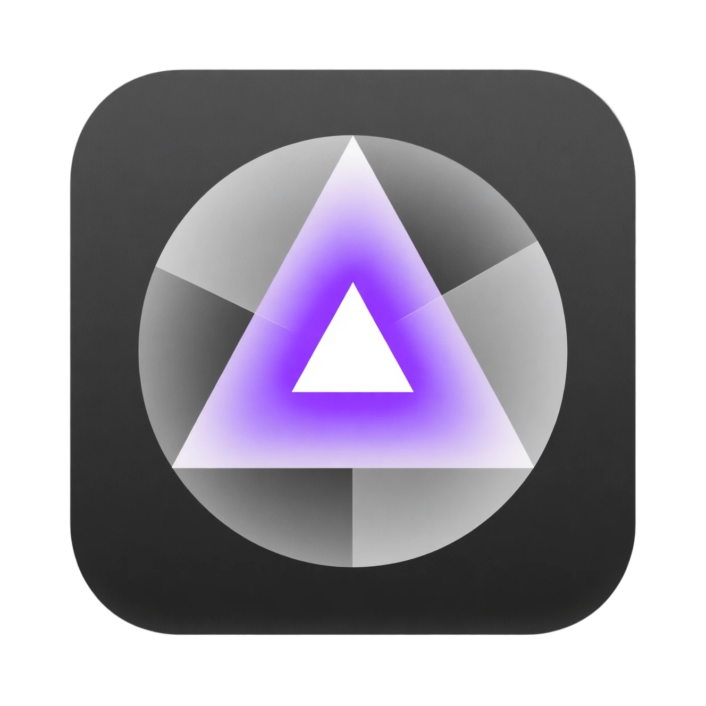

<div align="center">
  

  # ModelScope Prism

  **Blending Conversation, Vision, and Creativity into One ModelScope Exploration Space**

**[中文](./README.md) | English**

  </div>

  

---

**[ModelScope Prism](https://modelscope-prism.neutrinoy.xyz)** is an open-source AI web application built with Next.js. As a modern frontend interface for ModelScope API services, it integrates three core capabilities: **LLM Chat**, **VLM Visual Recognition**, and **AIGC Image Generation**. It provides a smooth, beautiful, and powerful AI experience without the need for complex backend deployment.

### ✨ Core Highlights

- **🧠 Deep Thinking Mode**: Supports built-in models like **DeepSeek V4 Flash**, **DeepSeek V4 Pro**, **GLM-5.2**, and **Qwen3.5**. Enable it to natively display the **Chain of Thought (CoT)**, making the AI's reasoning process visible.
- **🎨 AIGC Canvas**: More than just image generation—supports **LoRA Model Loading**, **CFG/Steps Fine-tuning**, **Custom Resolutions**, and an **Immersive Image Gallery**.
- **👀 Multimodal Vision**: Supports visual models like **Qwen3-VL**, allowing you to upload images for in-depth Q&A and analysis.
- **🔒 Data Privacy & Security**: Adheres to the **Local-First** principle. All chat history, Access Tokens, and settings are stored locally in your **browser (Local Storage)**. No data is uploaded to third-party servers other than direct calls to the ModelScope API.
- **📱 Responsive Design**: Optimized for the best interactive experience, whether on a 4K large monitor or a mobile device.

---

### 🚀 Quick Start

#### 1. Get Access Token
This project relies on the Serverless Inference API provided by ModelScope.
1. Log in and visit [ModelScope Access Token](https://modelscope.cn/my/myaccesstoken).
2. Copy your Access Token.

#### 2. Configure ModelScope Prism
1. Open the [deployed website](https://modelscope-prism.neutrinoy.xyz) (or visit `http://localhost:3000` after starting locally).
2. Click the **Settings Icon** ⚙️ on the **Dock** at the bottom of the page.
3. Paste your Access Token into the **ModelScope Access Token** field and save.

#### 3. Start Creating!
*   **💬 Chat**: Switch to the **LLM Module**. Built-in models (DeepSeek, Qwen, GLM, etc.) allow you to toggle **"Reasoning"** from the top navigation bar to experience deep thinking.
*   **👁️ Vision**: Switch to the **VLM Module**. Upload or paste an image to recognize objects, extract text, or chat about the scene.
*   **🎨 Image**: Switch to the **AIGC Module**. Enter a prompt, adjust parameters, and generate high-quality images.

#### ⚠️ Important: Data Safety & Backup
All your chat history and generated image links are **saved in your current browser**.
*   If you **clear your browser cache** or use **Incognito Mode**, data will be lost.
*   It is recommended to periodically click the **Download Icon** 📥 in the sidebar history to export important sessions as **Markdown** files for local backup.

---

### 🧩 Module Details

#### 💬 LLM Deep Chat
*   **Built-in Models**: Popular series like Qwen, DeepSeek, and GLM are preset in the top bar. Click the name to switch instantly.
*   **Custom Models**: Supports manual input of any text generation model ID from ModelScope.
    *   👉 [Find more Text Generation Models](https://modelscope.cn/models?filter=inference_type&page=1&tabKey=task&tasks=hotTask:text-generation&type=tasks)
*   **Thinking Process**:
    *   **Built-in Models**: Click the **"Reasoning"** tag under the model name in the top bar to toggle on/off.
    *   **Custom Models**: Click the settings icon ⚙️ at the bottom and choose `Auto`, `Try On`, or `Try Off`. Prism hides the provider-specific protocol details; if the model rejects the thinking control parameter, it retries with the model default and shows a notice.
    *   *Note: The thinking process is displayed elegantly in a collapsible/quoted format, supporting click-to-expand.*

#### 👁️ VLM Visual Understanding
*   **Image Chat**: Upload an image and ask "What is in the picture?" or "Extract text from the image".
*   **Vision Thinking Mode**: Toggle thinking directly from the input bar, with the same reasoning display experience as the LLM module.
*   **Custom Models**: Besides the built-in Qwen-VL, you can try other multimodal models supporting OpenAI format.
    *   👉 [Find more Image-to-Text Models](https://modelscope.cn/models?filter=inference_type&page=1&tabKey=task&tasks=hotTask:image-text-to-text&type=tasks)

#### 🎨 AIGC Creative Canvas
ModelScope has a thriving ecosystem of text-to-image models. We adopted an open design:
*   **Custom Model ID**: You can enter any Text-to-Image Model ID from ModelScope in the settings.
    *   👉 [Find more Text-to-Image Models](https://modelscope.cn/models?filter=inference_type&page=1&tabKey=task&tasks=hotTask:text-to-image-synthesis&type=tasks)
    *   *Compatibility Hint: Models based on **SDXL** or **SD 1.5** architectures work best. Newer architectures like Flux or Qwen-Image may require self-testing of parameters.*

**Professional Control Panel** (Click the adjustment icon inside the input box to open):

To accommodate varying parameter compatibility across models, we designed a **Basic/Advanced** dual mode:

*   **Basic Mode (Default)**: Sends only essential parameters for maximum compatibility.
    *   **Aspect Ratio / Size**: Presets for common resolutions; supports **Custom** width/height.
    *   **Negative Prompt**: Tell the AI what you do **NOT** want to see (e.g., `blurry, ugly, low quality`).
*   **Advanced Mode**:
    *   Unlock by toggling **"Enable Advanced Mode"** in the panel. Once unlocked, you can adjust (*Note: Improper settings may degrade quality*):
    *   **Steps**: Iteration steps. Higher values mean more detail but longer time (Recommended: **20 - 30**).
    *   **CFG**: Prompt adherence. Higher follows prompt strictly; lower allows AI freedom (Recommended: **3.5 - 7.0**).
    *   **Seed**: Seed number. Use the same seed to reproduce a specific image.
    *   **LoRA**: Supports loading style models. Enter the LoRA Model ID, and the system automatically balances weights (Supports mixing up to 6 LoRAs).

---

### 📝 Changelog

#### v1.4 [2026.07.08]

**✨ Features**
*   **Built-in Model Capability Convergence**: Rebuilt the preset list from ModelScope probe results, keeping only four confirmed usable models: DeepSeek V4 Flash, DeepSeek V4 Pro, GLM-5.2, and Qwen3.5. Each model now has a fixed profile for text, vision, thinking, and output token behavior.
*   **Multimodal Input in LLM Chat**: Added image input to the LLM module using the shared reference image component. The UI now disables unsupported entry points automatically when a model is text-only, URL-only, or does not support local image uploads.
*   **VLM Thinking Mode**: Added a dedicated `visionThinkingIntent` state and composer-level thinking toggle for the Vision module, supporting Auto / On / Off behavior based on model capability while reusing the unified reasoning display path.
*   **Streaming-first Model Probe**: Refined probing around the product's real streaming chat path, detecting `enable_thinking`, `thinking.type`, `chat_template_kwargs`, `max_tokens`, quota limits, and unavailable upstream providers.

**🚀 Improvements & Refactoring**
*   **Lighter Model Strategy**: Replaced broad runtime fallback behavior with fixed built-in model profiles plus conservative best-effort handling for custom model IDs, reducing unpredictable probing costs on Vercel.
*   **Unified Single-row Composer**: Aligned Chat, Vision, and AIGC around a compact single-row input layout where reference image, parameters, thinking, and send/stop actions live in one control surface.
*   **Composer-level Thinking Control**: Moved thinking controls into the message composer and surfaced capability-aware states such as `Reasoning Active`, `Chat Mode`, and `Thinking Auto`.
*   **Cleaner Model Selector**: Reworked model capability labels into `Text` / `Vision` badges and unified the selected state with a more restrained secondary background.
*   **Frontend Style Spec**: Added a frontend style consistency design note to keep future UI work aligned on layout density, component boundaries, and capability-state presentation.

**🐛 Bug Fixes**
*   **Probe Error Classification**: Classified ModelScope `402 insufficient balance` as `quota_limited` instead of model unavailable, and improved streaming JSON error parsing plus token-cap truncation detection.
*   **Qwen Vision Capability Fix**: Updated Qwen3.5 to support remote image URLs while rejecting data URL uploads, preventing the UI from exposing an unsupported local-upload path.

#### v1.3 [2026.06.27]

**✨ Features**
*   **Unified Conversation API**: Merged the former LLM and VLM backend paths into `app/api/conversation`, with one streaming endpoint for text, images, reasoning output, and incremental responses.
*   **Minimal Regression Pipeline**: Added `scripts/smoke.mjs` for pre-release validation of the critical chat + image paths.
*   **Automated Blackbox Probe**: Introduced a modular probe script that generates both JSON diagnostics and Markdown capability overviews for arbitrary ModelScope models.

**🚀 Improvements & Refactoring**
*   **ModelScope Adapter Refactor**: Added `lib/modelscope/conversation.ts` and `conversation-service` to centralize OpenAI-compatible requests, NDJSON parsing, and frontend session calls.
*   **Shared Streaming Session Layer**: Extracted a reusable stream session runner so Chat and Vision share stop-generation, error handling, and incremental update behavior.
*   **Tooling and Config Update**: Migrated to pnpm lockfiles and Biome checks, while centralizing rate limits, timeouts, and body-size thresholds in the config layer.
*   **AIGC Stability Upgrade**: Added request IDs, timeouts, rate limiting, and sanitized error handling to image task APIs for better production diagnostics and recovery.

**🐛 Bug Fixes**
*   **Local Storage Overflow Fix**: Replaced capacity-limited `localStorage` with asynchronous `IndexedDB`, reducing `QuotaExceededError` risk for multimodal sessions with large images.
*   **Request Observability**: Added end-to-end `requestId` propagation (response header + server logs) across chat, vision, and image APIs for faster incident tracing.

#### v1.2 [2026.03.03]

**✨ Features**
*   **Unified Reference Image Entry**: Added a left-icon reference image trigger in both VLM and AIGC input bars. Click to expand URL upload and local upload in one place.
*   **Minimal Regression Pipeline**: Added `scripts/smoke.mjs` for pre-release one-command validation of the critical chat + image paths.
*   **Probe Mode Upgrade**: Enhanced `scripts/probe.mjs` with `quick/full` modes and historical report comparison for the same model.

**🚀 Improvements & Refactoring**
*   **Centralized API Config**: Introduced `lib/config.ts` and moved rate-limit, timeout, body-size, and retry thresholds to env-driven configuration.
*   **Shared Streaming Session Layer**: Extracted reusable NDJSON parser and session runner for Chat/Vision to reduce duplicated logic and improve behavior consistency.
*   **AIGC Stability Upgrade**: Replaced fixed polling with backoff polling (3s → 5s → 8s), plus total timeout control and refresh-resume for in-progress tasks.
*   **Model Strategy Abstraction**: Introduced a minimal `ModelProfile` structure while preserving backward compatibility.

**🐛 Bug Fixes**
*   **Request Observability**: Added end-to-end `requestId` propagation (response header + server logs) across chat/vision/image APIs for faster incident tracing.
*   **Probe Misclassification Fix**: Fixed a quick-mode edge case where reasoning strategy could be incorrectly classified as `native_always_on`.

#### v1.1 [2026.03.02]

**✨ Features**
*   **Model Ecosystem Upgrade**: Converged the preset model list to probed usable models: DeepSeek V4 Flash, DeepSeek V4 Pro, GLM-5.2, and Qwen3.5.
*   **Automated Blackbox Probe**: Introduced `scripts/probe.mjs`, an automated testing script to dynamically sniff parameter strictness and reasoning capabilities of any new ModelScope model.
*   **Enhanced Streaming Control**: Integrated native `AbortController` into both LLM and VLM modules. The send button now dynamically transforms into a "Stop Generation" button.
*   **VLM Reasoning Collapse**: Refactored the VLM backend stream to NDJSON format, allowing the frontend to neatly extract and elegantly collapse the Chain of Thought (Reasoning) of modern multimodal models.

**🚀 Improvements & Refactoring**
*   **Strategy Architecture**: Upgraded the reasoning parameter injection logic to a structural type system (`root_boolean`, `kwargs_dict`, `native_always_on`). Refactored UI logic to visually lock and protect "always-on" reasoning models.
*   **Smart Image Compression**: Introduced a frontend quality-based compression algorithm (`canvas quality 0.8`) that preserves original image dimensions for VLM, drastically reducing payload size.
*   **Smart Scroll Interaction**: Overhauled the chat auto-scroll logic. Auto-scrolling is automatically suspended when the user scrolls up to review history, returning full scroll control to the user.

**🐛 Bug Fixes**
*   **Local Storage Overflow Fix**: Replaced the capacity-limited `localStorage` (5MB) with the highly scalable, asynchronous `IndexedDB` for global state management, permanently solving `QuotaExceededError` crashes in multimodal scenarios.

#### v1.0 [2025.12.29]
*   🎉 Initial release of ModelScope Prism, integrating LLM, VLM, and AIGC core features.

---

### 💻 Developer Guide

If you wish to run locally or contribute, follow these steps.

#### Requirements
*   Node.js 18+
*   pnpm

#### Installation & Run

```bash
# 1. Clone repository
git clone https://github.com/NeutrinoY/ModelScope-Prism.git

# 2. Enter directory
cd ModelScope-Prism

# 3. Install dependencies
pnpm install

# 4. Start development server
pnpm dev
```

Open your browser and visit `http://localhost:3000`.

#### Core Project Structure
*   **`app/api/`**: Backend route layer (Node/Edge Runtime)
    *   `conversation/route.ts`: Unified streaming endpoint for LLM/VLM.
    *   `image/generate/route.ts`, `image/status/[taskId]/route.ts`: AIGC task submission and status polling.
*   **`components/`**: View and interaction layer
    *   `chat/`, `vision/`, `image/`: UI modules for the three core capabilities.
    *   `shared/`: Cross-module reusable components (e.g. `reference-image-input.tsx`, Markdown renderer, settings modal).
    *   `layout/`, `ui/`: Layout containers and base UI primitives.
*   **`hooks/`**: Reusable frontend flow logic
    *   `use-ndjson-stream.ts`: Unified NDJSON stream parser.
    *   `use-stream-session-runner.ts`: Unified request/abort/error flow for streaming sessions.
*   **`lib/`**: Domain and infrastructure utilities
    *   `store.ts`: Global state persistence with Zustand + IndexedDB.
    *   `model-capabilities.ts`: Model capability profiles, modality support, and thinking strategy mapping.
    *   `modelscope/conversation.ts`: ModelScope OpenAI-compatible adapter powered by the OpenAI SDK.
    *   `models.ts`: Compatibility facade for existing frontend model imports.
    *   `config.ts`: Centralized thresholds (rate limit, timeout, payload size) via env config.
    *   `api-security.ts`: API security utilities (rate limiting, timeout, error sanitization, requestId).
    *   `services/`: Frontend API call wrappers (e.g. `conversation-service.ts`).
*   **`scripts/`**: Automation and validation
    *   `smoke.mjs`: Pre-release minimal chain validation (chat + image).
    *   `probe.mjs`: Lightweight ModelScope chat compatibility probing.

#### Model Probe

```bash
# lightweight compatibility probe
pnpm probe Qwen/Qwen3.5-397B-A17B
```

Probe reports are written to `probe-reports/`. Each probe writes two files: `probe-report-*.json` is the diagnostic report with per-case status codes, latency, content validity, reasoning detection, parse errors, error categories, and raw error previews; `probe-report-*.md` is the human-readable capability overview with streaming chat, thinking control, vision input, output token parameter, and a ready-to-copy profile snippet for `lib/model-capabilities.ts`.

---

<div align="center">
  If this project helps you, please give it a ⭐️ Star!<br/>
  Made with ❤️ by NeutrinoY
</div>
